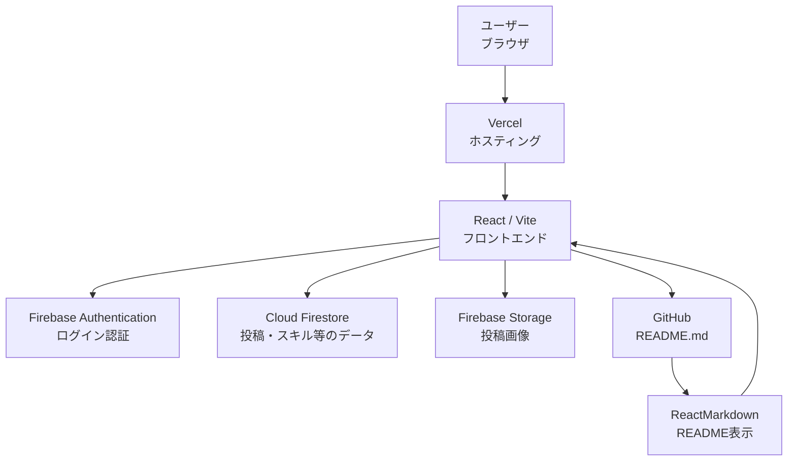
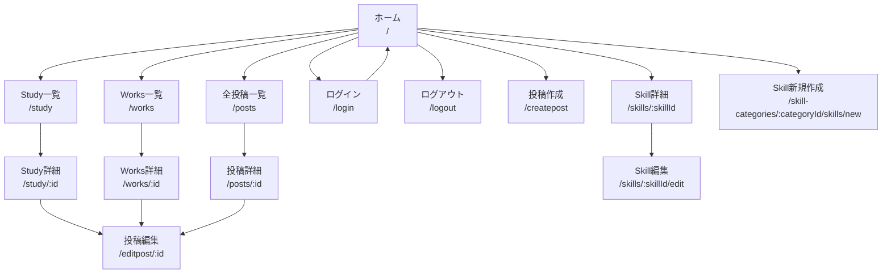
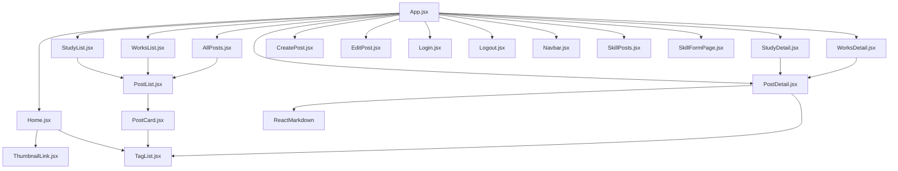

# Portfolio Site

## 概要

- エンジニアとして対応した案件や、個人開発（勉強用で作ったもの含め）をまとめたポートフォリオサイトです。
- 各言語で自分がどんなことを理解して、何ができるのかも表にまとめて記載。
- React・Firebaseを用いて開発し、作品紹介だけでなく管理画面から投稿の追加・編集・削除が行えます。


---

## 解決したい課題（なぜ作ったのか）

自分が対応した案件・個人開発を一覧で見れて、かつ、どんな言語をどこまで使用できるのかがわかるようなものを作りたかった。

---

## デモ

### 公開URL

https://portfolio-react-rho-snowy.vercel.app/

### GitHub

https://github.com/aachan1127/portfolio-react

---

## スクリーンショット

### トップページ

（画像）

### 投稿一覧

（画像）

### 投稿詳細

（画像）

### 管理画面

（画像）

---

## 主な機能

- 投稿一覧表示
- 投稿詳細表示
- 投稿の追加・編集・削除（CRUD）
- Firebase Authenticationによるログイン認証
- Firestoreによるデータ管理
- Firebase Storageによる画像アップロード
- GitHub READMEの自動取得・表示
- YouTube埋め込み表示
- タグによる絞り込み
- 表示順の変更
- レスポンシブ対応
- アクセシビリティ対応

---

## 使用技術

| 分類 | 技術 |
|------|------|
| Frontend | React |
| Routing | React Router |
| Backend | Firebase |
| Database | Cloud Firestore |
| Authentication | Firebase Authentication |
| Storage | Firebase Storage |
| Hosting | Vercel |
| Markdown | React Markdown |
| Library | remark-gfm |
| Version Control | Git / GitHub |

---

## システム構成

本ポートフォリオサイトは、React（Vite）でフロントエンドを構築し、Firebaseを利用して認証・データ管理・画像保存を行っています。

また、投稿詳細画面ではGitHub上のREADMEを取得し、`ReactMarkdown`を使用してサイト内に表示しています。



### 各サービスの役割

| 技術・サービス                 | 役割                    |
| ----------------------- | --------------------- |
| React                   | UI・画面の構築              |
| Vite                    | Reactの開発・ビルド環境        |
| React Router            | ページ遷移・ルーティング          |
| Firebase Authentication | 管理者のログイン認証            |
| Cloud Firestore         | 投稿・スキルなどのデータ管理        |
| Firebase Storage        | 投稿画像の保存               |
| GitHub                  | 各制作物のREADME管理         |
| ReactMarkdown           | GitHubから取得したREADMEの表示 |
| Vercel                  | フロントエンドのホスティング・公開     |


## 画面遷移図



※ 投稿作成ページは未ログインの場合ログイン画面へ遷移。</br>
投稿の編集・削除ボタン、トップページの表示枠変更、Skillの作成・編集ボタンはログイン中のみ画面に表示される。</br>

---

## コンポーネント構成図




### 主な役割

| ファイル・コンポーネント     | 役割                                 |
| ---------------- | ---------------------------------- |
| `App.jsx`        | ルーティングやアプリ全体の入口                    |
| `Home.jsx`       | トップページを表示                          |
| `Navbar.jsx`     | ナビゲーションを表示                         |
| `StudyList.jsx`  | Study一覧ページとして`PostList`を呼び出す        |
| `WorksList.jsx`  | Works一覧ページとして`PostList`を呼び出す        |
| `AllPosts.jsx`   | 全投稿一覧ページとして`PostList`を呼び出す          |
| `PostList.jsx`   | Study・Works・全投稿などの投稿一覧を表示          |
| `StudyDetail.jsx` | Study詳細ページとして`PostDetail`を呼び出す      |
| `WorksDetail.jsx` | Works詳細ページとして`PostDetail`を呼び出す      |
| `PostDetail.jsx` | 投稿詳細、画像、GitHub README、YouTubeなどを表示 |
| `CreatePost.jsx` | 投稿を新規作成                            |
| `EditPost.jsx`   | 投稿を編集                              |
| `Login.jsx`      | 管理者ログイン                            |
| `Logout.jsx`     | ログアウト処理                            |
| `PostCard.jsx`   | 投稿1件分のカードを表示する共通コンポーネント            |
| `TagList.jsx`    | 投稿に設定されたタグを表示する共通コンポーネント           |
| `ThumbnailLink.jsx` | トップページのサムネイル付きリンクを表示           |
| `SkillPosts.jsx` | Skillの詳細と、そのSkillに関連する投稿を表示         |
| `SkillFormPage.jsx` | Skillの編集・新規作成を担当                |
| `ReactMarkdown`  | GitHubから取得したREADMEをMarkdownとして表示   |


# 工夫した点

## GitHub READMEの自動取得
作品を更新した際の、投稿詳細画面での説明文の書き換えの手間を省くために、</br>
投稿時にGitHubリポジトリURLを登録すると、そのリポジトリのREADME.mdを取得し、React Markdownで表示する仕組みを実装しました。</br>
READMEをGitHub側で更新するだけでポートフォリオにも反映されるため、管理がしやすくなるように工夫しました。

※ 【READMEを表示させるか】、【自分で直接記載したものを表示させるか】は、管理画面で選択できるようにしています。

---

## アクセシビリティ

より多くの人が閲覧しやすいサイトを目指し、アクセシビリティ改善に取り組みました。

ー　実施した内容　ー

- VoiceOverによる操作確認（キーボード操作への対応）
- LighthouseによるAccessibilityチェックの実施
- Claude Cowork によるアクセシビリティチェックの実施
- WAVEによるチェック

ー　改善した内容　ー
- 見出しレベルの見直し
- alt属性の改善
- フォーカス表示の改善
- コントラストの改善

---

## UI / UX

使いやすさを意識し、以下のような改善を行いました。

- 投稿カードのホバーアニメーション
- 画像拡大表示
- レスポンシブデザイン
- タグ表示
- 投稿順位の管理（タグによる絞り込み）

---


# 苦労したこと・解決方法

## 1. GitHub README表示

### 課題

「GitHub上のREADMEをそのまま表示したい」

(GitHubのAPIを利用すると、取得回数に上限があったりしたので、まずはAPIを利用せずに表示できる方法はないかと模索しました)

### 解決方法

GitHub APIではなく、raw.githubusercontent.comからREADME.mdを取得し、React Markdownで表示する仕組みを実装

---

## 2. アクセシビリティ改善

### 課題

「VoiceOverで投稿カードの内容が適切に読み上げられない問題がありました。」

（投稿カードにキーボード操作でフォーカスが当たらないので、投稿の詳細ページに遷移できなくなってしまっていた）

### 解決方法

- aria-labelの追加
- 見出し構造の修正
- alt属性の見直し
- フォーカス管理の改善

を行い、スクリーンリーダーでも利用しやすいよう改善しました。

↓ この今回の対応を下記技術記事にまとめています。
https://zenn.dev/aachan/articles/1de49888ab9257


---

# 今後改善したいこと

- 検索機能
- ダークモード
- ページネーション
- GitHub API対応
（GitHub APIを利用して、READMEだけでなく使用言語や最終更新日などのリポジトリ情報も表示する）
- CI/CDの導入（CDは実装済み）
（GitHub Actionsを使用し、push時にESLint・テスト・ビルド確認を自動実行する
- キャッシュ対応
（GitHub READMEや投稿データをキャッシュし、同じデータへの不要な再通信を減らす）
---

# セットアップ方法

## Clone

```bash
git clone https://github.com/aachan1127/portfolio-react
```

## Install

```bash
npm install
```

## Run

```bash
npm run dev
```

---

## 環境変数

`.env`

```env
VITE_FIREBASE_API_KEY=

VITE_FIREBASE_AUTH_DOMAIN=

VITE_FIREBASE_PROJECT_ID=

VITE_FIREBASE_STORAGE_BUCKET=

VITE_FIREBASE_MESSAGING_SENDER_ID=

VITE_FIREBASE_APP_ID=
```


---
